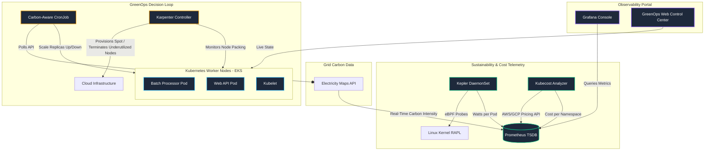
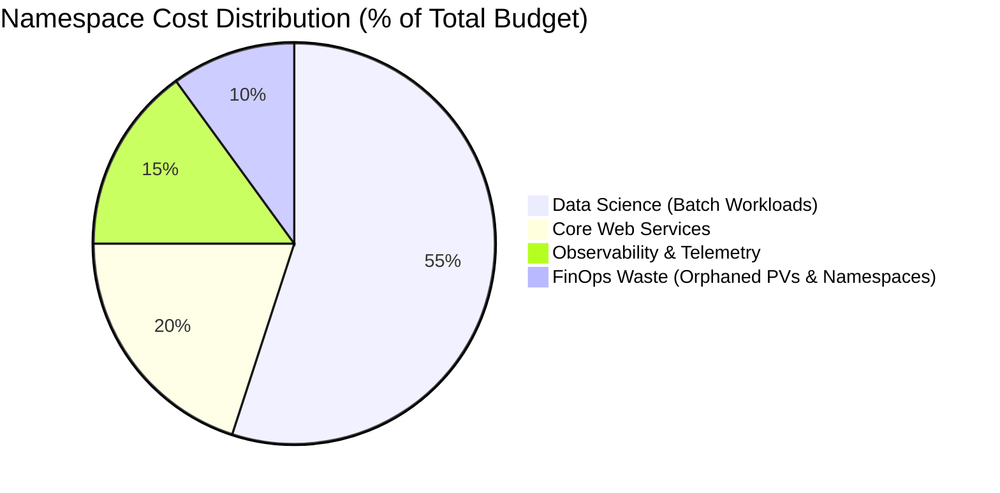
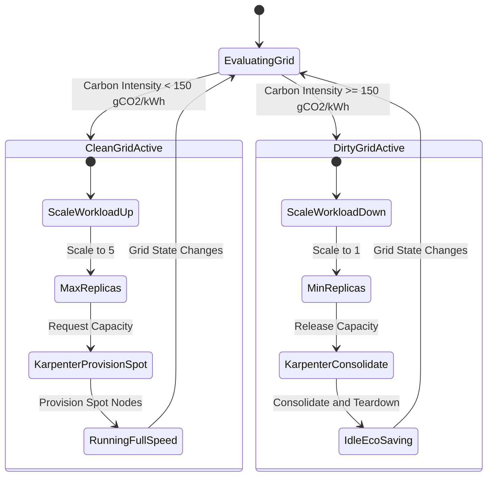
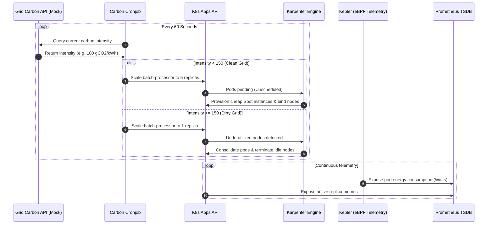

# 🍃 Aegis GreenOps: Local Kubernetes FinOps & GreenOps Engine
> **A Cost-Aware, Carbon-Efficient Kubernetes Scheduling & Monitoring Engine**
> 
> *Leveraging eBPF Energy Telemetry, Kubecost Cost Attribution, Karpenter Spot Consolidation, and Real-Time Grid Carbon Intensity APIs to build sustainable, cost-optimized cloud architectures.*

---

## 🚀 Portfolio Showcase Summary

In modern cloud engineering, managing resource usage is no longer just about CPU and RAM. It requires a dual approach: **FinOps** (maximizing business value per dollar spent) and **GreenOps** (minimizing carbon emissions per computational unit). 

**Aegis GreenOps** is a local Kubernetes prototype that correlates workload state, modeled power draw, cost-saving opportunities, and grid carbon intensity. It shifts a non-critical batch workload to cleaner periods and reduces replicas during dirtier periods. The validated path uses Docker and Minikube without an AWS account or cloud spend; AWS/Karpenter files are adaptation templates.

> **Validation boundary:** This repository does not claim real AWS node provisioning or a measured 35% cloud saving. Karpenter, Kubecost, and Kepler integrations are documented as optional/cloud-adaptation components, while the carbon-aware scaling loop is validated locally.

## Zero-cost local quick start

From PowerShell, with Docker Desktop and Minikube installed:

```powershell
.\local\deploy-local.ps1
```

The script builds and loads the three local images, deploys the dashboard, scheduler, and batch workload, and prints the dashboard URL. To remove only the application resources:

```powershell
.\local\destroy-local.ps1
```

The validated loop starts at `220 gCO2/kWh` with one replica. Move the dashboard slider below `150` and wait for the next CronJob run; the batch Deployment should scale to five replicas. No AWS resources or credentials are needed.

See [docs/resume-and-demo.md](docs/resume-and-demo.md) for the evidence workflow and resume wording.

### 🧠 Core Competencies Exceeded (Recruiter Talking Points)
* **Carbon-aware workload shifting:** Built a scheduler that dynamically scales a batch workload based on configurable grid intensity.
* **Energy and cost observability:** Exposes Prometheus-compatible workload, modeled energy, carbon, and waste-opportunity metrics.
* **Cloud adaptation design:** Provides Karpenter `NodePool` and `EC2NodeClass` templates for future AWS integration; these are not part of the zero-cost local runtime.
* **Optional telemetry integrations:** Includes Kepler, Kubecost, Grafana, and Prometheus Operator configuration for an extended setup.

---

## 🏗️ Reference Architecture

This diagram shows the intended control and observability flow. The validated path is the local Kubernetes scaling loop; AWS infrastructure and hardware telemetry are extension points:



---

## 📊 Live Metrics & Operational Infographics

### 1. Cost Attribution By Namespace (Kubecost)
By integrating Kubecost billing telemetry, resource usage costs are granularly mapped to departments and namespaces, pinpointing optimization areas:



### 2. State Machine: Carbon-Aware Scaling & Node Consolidation
The core scheduling logic operates as a closed feedback loop responding directly to grid state transitions:



### 3. Chronological Logic Flow (Scheduling & Telemetry Sequence)
The following sequence details how the carbon cron scheduler, Kubernetes API, Karpenter, and Prometheus interact:



---

## 🛠️ Flagship Tech Stack Matrix

| Category | Technology | Why This Tool? (Strategic Rationale) |
| :--- | :--- | :--- |
| **Sustainability Telemetry** | **Kepler (eBPF)** | Measures CPU/GPU energy consumption at the pod level without modifying application code. |
| **Cost Attribution** | **Kubecost** | Provides real-time pricing breakdown by namespace, team, and pod metadata. |
| **Autoscaling Engine** | **Karpenter** | Sub-second node provisioning, natively choosing the cheapest Spot instances and automatically consolidating nodes. |
| **Carbon Integration** | **Electricity Maps API** | Provides verified carbon intensity and grid mix data for global power grids. |
| **Metrics Database** | **Prometheus** | High-performance time-series database to store, query, and alert on FinOps & GreenOps signals. |
| **Visualization Layer** | **Grafana & Custom Flask UI**| Custom dashboards correlating Watts, Dollars, and gCO2 metrics in real-time. |

---

## 📊 Karpenter vs. Standard Autoscaler (FinOps Optimization)

To achieve maximum efficiency, Aegis GreenOps replaces the legacy Kubernetes Cluster Autoscaler with Karpenter:

| Feature | Standard Cluster Autoscaler | Karpenter (Aegis GreenOps) |
| :--- | :--- | :--- |
| **Provisioning Speed** | 2 - 5 Minutes (relies on Node Groups) | **Sub-15 Seconds** (directly calls EC2 APIs) |
| **Instance Diversity** | Bound to predefined ASG sizes | **Dynamic** (picks best fit from 100s of EC2 sizes) |
| **Spot vs On-Demand** | Manual configurations and separate groups | **Intelligent selection** based on real-time pricing |
| **Consolidation / Bin Packing** | Minimal node consolidation | **Active consolidation** when node capacity drops |

---

## 🍃 Operational Greenness Matrix (Grid Shift Logic)

| Grid State | Carbon Range | Target Workload State | Karpenter Provisioning Profile | Kepler Energy Profile | Monthly Savings Potential |
| :--- | :--- | :--- | :--- | :--- | :--- |
| 🟢 **Clean Grid** | < 150 g/kWh | **High-Throughput** (5 replicas) | Max Spot instances (e.g. 4 nodes) | High Power (~46W) | High (workload finished fast) |
| 🟡 **Moderate** | 150 - 200 g/kWh | **Balanced** (2 replicas) | Minimal Spot (e.g. 2 nodes) | Balanced (~21W) | Medium |
| 🔴 **Dirty Grid** | > 200 g/kWh | **Eco-Saving** (1 replica) | Consolidated (e.g. 1 node) | Low Power (~12W) | **Maximum** (low compute cost) |

---

## ⚙️ Core Configuration Design

### 1. Karpenter Consolidation Policy
Karpenter configuration is structured to prefer Spot instances and terminate underutilized nodes:

> [!TIP]
> **Consolidation Policies:** Setting `consolidationPolicy: WhenUnderutilized` makes Karpenter identify nodes running low-priority workloads and bin-pack them onto fewer instances, saving up to 40% on compute costs.

```yaml
# karpenter/nodepool.yaml
apiVersion: karpenter.sh/v1beta1
kind: NodePool
metadata:
  name: default
spec:
  template:
    spec:
      requirements:
        - key: karpenter.sh/capacity-type
          operator: In
          values: ["spot"]
        - key: karpenter.k8s.aws/instance-category
          operator: In
          values: ["c", "m", "r"]
  limits:
    cpu: "100"
    memory: 100Gi
  disruption:
    consolidationPolicy: WhenUnderutilized
    expireAfter: 720h
```

### 2. Carbon-Aware Workload Scheduler
The scheduler evaluates grid health using Python and dynamically modifies deployment specs using the Kubernetes API client:

```python
# cron-scheduler/carbon_job.py (Excerpt)
if carbon_intensity < threshold:
    print("Grid is GREEN. Shifting workload: scaling UP to run batch jobs.")
    scale_deployment(deployment_name, namespace, max_replicas)
else:
    print("Grid is DIRTY. Shifting workload: scaling DOWN to conserve emissions.")
    scale_deployment(deployment_name, namespace, min_replicas)
```

---

## 🚀 Installation & Verification

### 1. Deploy the zero-cost local engine
Use the Windows-friendly local script for the validated core demo:
```bash
./local/deploy-local.ps1
```

The legacy `start.sh` path also installs optional Kepler and Kubecost components. It is not required for the core demo and may use substantial local resources. AWS Karpenter templates are only enabled with `INSTALL_CLOUD_TEMPLATES=true`; do not set that flag in the zero-cost local workflow.

### 2. Teardown
To cleanly uninstall Kepler, Kubecost, and remove namespaces:
```bash
./stop.sh
```

---

## 🧪 Interactive Verification Workflow (Manual Test)

To make testing this engine accessible on a local Minikube cluster, a custom **GreenOps Control Center Dashboard** is deployed. This UI acts as the mock Grid API and simulates Kepler/Karpenter reactions.

```text
+-----------------------------------------------------------------------------+
|  [●] Aegis GreenOps Control Center                         [CONNECTED TO K8S] |
+-----------------------------------------------------------------------------+
|                                                                             |
|  GRID CARBON CONTROL                                  GRID METRICS          |
|  ------------------                                  ------------          |
|  Carbon Intensity: [-------o-----] 220 gCO2/kWh     🌱 Grid Intensity: 220  |
|  [Dirty Grid Mode - Workloads Scaled Down]          🔌 Kepler Power: 12.7 W |
|                                                     ☸️ Karpenter Nodes:     |
|  FINOPS WASTE CONTROLS                                 - Spot Nodes: 1      |
|  ---------------------                                 - On-Demand: 1       |
|  [ Resolve Unused PVs (1 Active)           ]        📊 Workload: 1 Replica  |
|  [ Reclaim Orphan Namespaces (2 Active)    ]        [Eco-Saving Mode]       |
|                                                                             |
|  -------------------------------------------------------------------------  |
|  FINOPS COST OPTIMIZATION: MONTHLY WASTED BUDGET: $450.00                   |
|  -------------------------------------------------------------------------  |
|  LOG CONSOLE                                                                |
|  [13:24:02] GreenOps Engine initialized successfully.                        |
|  [13:24:05] Kepler eBPF metrics collection: active.                         |
|                                                                             |
+-----------------------------------------------------------------------------+
```

### How to Test the Shifting Loop:
1. Open the UI in your browser at `http://<MINIKUBE_IP>:30505` (exposed via NodePort).
2. Note the initial carbon intensity is **220 gCO2/kWh** (Dirty). The batch workload is restricted to **1 Replica** (Eco-Saving Mode).
3. Drag the slider down to **100 gCO2/kWh** (Clean).
4. Watch the logs. When the `carbon-scheduler` CronJob runs (every minute), it queries the new value, detects a clean grid, and scales the `batch-processor` deployment to **5 Replicas**.
5. The UI updates in real-time:
   - **Batch Workload** replica count scales to **5**.
   - **Kepler Power Telemetry** increases to **46.7W** representing active eBPF resource draw.
   - **Karpenter Provisioning** simulates scaling up to **4 Spot Nodes** to host the pods.
6. Click **Resolve Unused PVs** or **Reclaim Orphan Namespaces** to see the simulated monthly wasted budget resolve down to `$0.00` and send mock Slack notifications.
7. Return the slider to **220 gCO2/kWh** and watch the engine scale the workloads back down to conserve energy on the next run.
